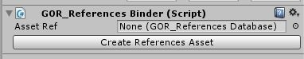
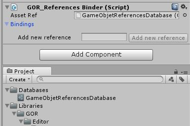
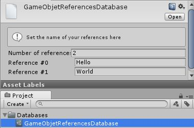
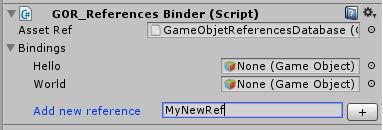
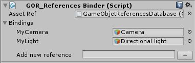
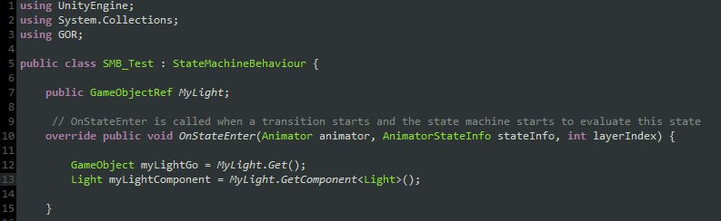
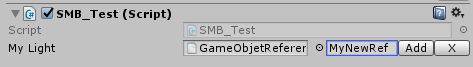
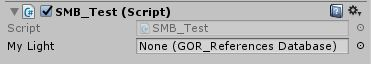
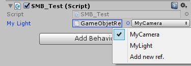

# GOR​ ​-​ ​G​ame​O​bject​ ​R​eferences
### v1.01

## Overview
This​ ​plugin​ ​aims​ ​to​ ​ease​ ​the​ ​access​ ​of​ ​GameObjects​ ​in​ ​a​ ​scene​ ​from​ ​assets
(AnimatorController,​ ​Prefabs​ ​or​ ​any​ ​other​ ​ScriptableObjects).

## Concept​ ​-​ ​How​ ​it​ ​works
The​ ​idea​ ​is​ ​to​ ​create​ ​a​ ​link​ ​between​ ​the​ ​scene,​ ​an​ ​asset​ ​that​ ​will​ ​contains​ ​the​ ​reference​ ​at
Start​ ​and​ ​the​ ​asset​ ​that​ ​need​ ​the​ ​GameObject​ ​reference.
So,​ ​we​ ​start​ ​by​ ​creating​ ​a​ ​database​ ​of​ ​references​ ​where​ ​we​ ​define​ ​the​ ​name​ ​of​ ​the
references.
Then,​ ​we​ ​create​ ​a​ ​GameObject​ ​that​ ​bind​ ​other​ ​GameObjects​ ​of​ ​the​ ​scene​ ​to​ ​the​ ​database
during​ ​the​ ​Start​ ​(so​ ​change​ ​the​ ​Script​ ​Execution​ ​Order​ ​can​ ​help).
Afterwards,​ ​we​ ​can​ ​use​ ​GameObjectRef​ ​in​ ​a​ ​script​ ​in​ ​a​ ​Prefab/StateBehavior/etc.​ ​to​ ​bind​ ​to
the​ ​database​ ​and​ ​the​ ​reference,​ ​and​ ​just​ ​use.”Get()”​ ​to​ ​access​ ​the​ ​GameObject​ ​from​ ​the
database.

## Steps
1​ ​-​ ​Creation​ ​of​ ​the​ ​GOR_ReferencesBinder
Create​ ​an​ ​empty​ ​GameObject​ ​and​ ​add​ ​the​ ​GOR_ReferencesBinder​ ​script.

2​ ​-​ ​Use​ ​the​ ​“Create​ ​References​ ​Asset”​ ​to​ ​create​ ​the​ ​reference​ ​database.

Now,​ ​the​ ​database​ ​is​ ​bound,​ ​but​ ​it​ ​is
empty​ ​for​ ​now.

You​ ​can​ ​select​ ​the​ ​database​ ​and​ ​add
the​ ​number​ ​of​ ​references​ ​you​ ​want​ ​to
set.

Or​ ​you​ ​can​ ​use​ ​the​ ​“Add​ ​new
reference”​ ​shortcut​ ​from​ ​the
GOR_ReferencesBinder​ ​to​ ​add​ ​a
reference​ ​to​ ​the​ ​database​ ​so​ ​you
don’t​ ​have​ ​to​ ​switch​ ​between​ ​the
database​ ​and​ ​the
GOR_ReferencesBinder.

3​ ​-​ ​Bind​ ​your​ ​GameObject​ ​using​ ​soft​ ​links

4​ ​-​ ​Add​ ​the​ ​GOR.GameObjectRef​ ​in​ ​your​ ​scripts

You​ ​can​ ​access​ ​your​ ​GameObject​ ​using​ ​GameObjectRef.Get()​ ​or​ ​directly​ ​a​ ​component
using​ ​GameObjectRef.GetComponent&lt;T&gt;().

5​ ​-​ ​In​ ​the​ ​Inspector​ ​of​ ​your​ ​script, ​bind​ ​the​ ​database…

…​ ​and​ ​set​ ​the​ ​reference​ ​you​ ​want​ ​to
use.​ ​You​ ​are​ ​done!

You​ ​can​ ​also​ ​add​ ​a​ ​new​ ​reference​ ​from​ ​here,​ ​by​ ​selecting​ ​“Add​ ​new​ ​ref.”

## Link

GitHub : https://github.com/Begounet/GameObjectRef